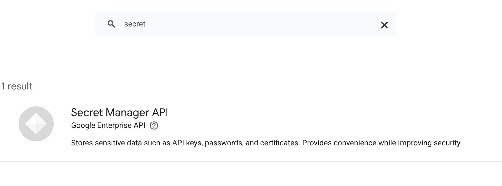
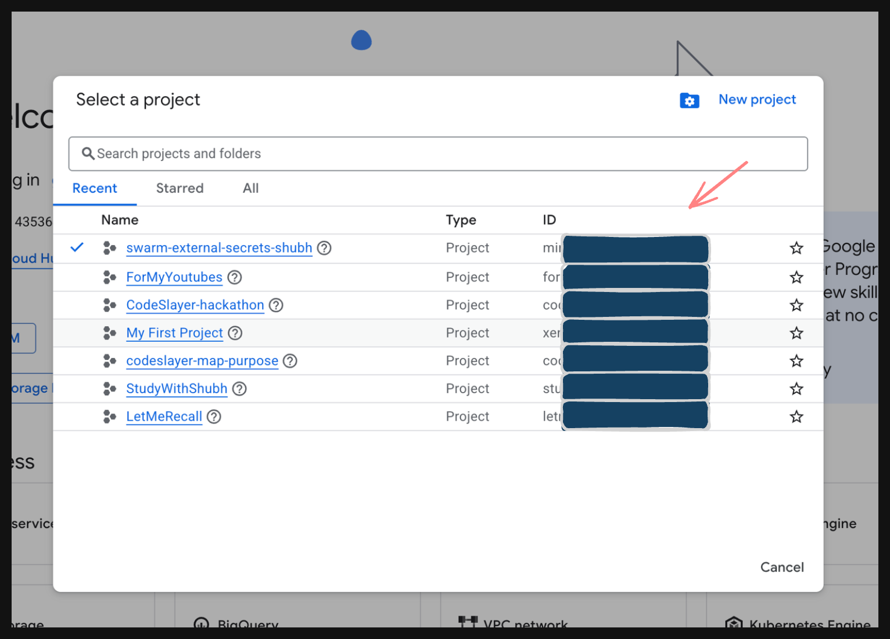

## This is a complete Operation Guide for GCP (Google Cloud Platform) Secret Manager Provider for [Swarm-External-Secrets](https://github.com/sugar-org/swarm-external-secrets)

# ⇒ Make sure to download the official Google SDK Dependencies

```bash
go get cloud.google.com/go/secretmanager/apiv1
go get google.golang.org/api/option
go mod tidy
```

# ⇒ Setup your [console.cloud.google.com](https://console.cloud.google.com/)

Enable the Secret Manager API in your google console account (if asking to enable billing then do so.)



### → OPTIONAL: creating the secrets in your account (from the UI) its upto you, coz further in the documentation you will see, we will do this via CLI (terminal)

**1. Create the Secrets in GCP:**

1. Go to your GCP Console and search for **Secret Manager**.
2. Click **+ CREATE SECRET**.
3. Name: `mysql-root-password`
4. Secret value: `gcp_super_secret_root`
5. Click **Create secret**.
6. Repeat steps 2-5 to create another secret named `mysql-user-password` with the value `gcp_super_secret_user`.

**2. Create a Service Account (Your Plugin's Identity):**

1. Search for **Service Accounts** (under IAM & Admin) in the GCP Console.
2. Click **+ CREATE SERVICE ACCOUNT**.
3. Name it: `docker-secrets-plugin` -> Click Create and Continue.
4. **CRITICAL STEP:** Under "Select a role", search for and select **Secret Manager Secret Accessor**. (If you skip this, it will get a 403 Permission Denied).
5. Click **Done**.

**3. Download the JSON Key:**

1. Click on the new `docker-secrets-plugin` service account in the list.
2. Go to the **KEYS** tab at the top.
3. Click **ADD KEY** -> **Create new key**.
4. Choose **JSON** and click Create.
5. This will download a `.json` file to your computer. Move this file into your project folder and rename it to `gcp-key.json` to make things easy.

*Also, grab your **Project ID**. You can find this on the GCP Home Dashboard (it usually looks like `my-project-12345`):*

you can find your project ID like this here, while you select/navigate between your projects:



# ⇒ Install the gcloud CLI locally in your machine

For Mac/Linux:

```bash
curl https://sdk.cloud.google.com | bash
```

Its gonna ask for some permissions, do yes…..yess..yes…. and continue!

then you need to `gcloud init` and login to that google account only of yours which youve just configured! and then select the correct project with your secret!

# ⇒ GCP Project Setup, via CLI/Terminal (One-Time)

> make sure you have your PROJECT_ID

### **1.  Enable the Secret Manager API**

```bash
gcloud services enable secretmanager.googleapis.com \
    --project=YOUR_PROJECT_ID
```

### **2. Create a Service Account**

```bash
gcloud iam service-accounts create swarm-secrets-sa \
    --display-name="Swarm External Secrets GCP" \
    --project=YOUR_PROJECT_ID
```

### **3. Grant Permissions**

```bash
gcloud projects add-iam-policy-binding YOUR_PROJECT_ID \
    --member="serviceAccount:swarm-secrets-sa@YOUR_PROJECT_ID.iam.gserviceaccount.com" \
    --role="roles/secretmanager.secretAccessor"

gcloud projects add-iam-policy-binding YOUR_PROJECT_ID \
    --member="serviceAccount:swarm-secrets-sa@YOUR_PROJECT_ID.iam.gserviceaccount.com" \
    --role="roles/secretmanager.admin"
```

### **4. Download the Key File**

```bash
gcloud iam service-accounts keys create gcp-key.json \
    --iam-account=swarm-secrets-sa@YOUR_PROJECT_ID.iam.gserviceaccount.com
```

If you already have gcp-key.json in the project root, like if youve downloaded/already completed the setup step in UI, skip this step. You already did this part!

# => Create Secrets in GCP

### **From CLI (`gcloud`)** (Recommended)

```bash
gcloud secrets create my-database-password \
    --replication-policy="automatic" \
    --project=YOUR_PROJECT_ID

echo -n '{"password":"super-secret-value-v1"}' | \
    gcloud secrets versions add my-database-password \
    --data-file=- \
    --project=YOUR_PROJECT_ID
```

> OR

### **From Google Cloud Console (UI)**

1. Go to [**https://console.cloud.google.com/security/secret-manager**](https://console.cloud.google.com/security/secret-manager)
2. Select your project from the top dropdown
3. Click **"+ CREATE SECRET"**
4. Fill in:
    - **Name**: `my-database-password`
    - **Secret value**: `{"password":"super-secret-value-v1"}`
    - **Replication policy**: Automatic
5. Click **"CREATE SECRET"**

## **⇒ Build & Install the Plugin**

### **1. Navigate to the correct working directory:**

```
cd /Users/<USERNAME>/___/___/swarm-external-secrets
```

### **2. Initialize Docker Swarm (if not already done)**

```bash
docker swarm init
```

> If you see "This node is already part of a swarm..", that's fine.

### **3. Remove old plugin (if exists)**

```bash
docker plugin disable swarm-external-secrets:latest --force 2>/dev/null || true
docker plugin rm swarm-external-secrets:latest --force 2>/dev/null || true
```

### **4. Build the Docker image**

```bash
docker build -f Dockerfile -t swarm-external-secrets:temp .
```

### **5. Create plugin rootfs directory**

```bash
mkdir -p plugin/rootfs
```

### **6. Extract the built binary into the rootfs**

```bash
docker rm -f temp-container 2>/dev/null || true

# Create a container from the image (does NOT run it, just creates it)
docker create --name temp-container swarm-external-secrets:temp

# Export the container's filesystem into plugin/rootfs
docker export temp-container | tar -x -C plugin/rootfs

docker rm temp-container
docker rmi swarm-external-secrets:temp
```

### **7. Copy the plugin config**

```bash
cp config.json plugin/
```

### **8. Create the Docker plugin**

```bash
docker plugin create swarm-external-secrets:latest plugin/
```

### **9. Clean up the plugin build directory**

```bash
rm -rf plugin/
```

# ⇒ Configure & Enable the Plugin

### **1. Set GCP configuration**

```bash
docker plugin set swarm-external-secrets:latest \
    SECRETS_PROVIDER="gcp" \
    GCP_PROJECT_ID="mimetic-setup-478719-f1" \
    GOOGLE_APPLICATION_CREDENTIALS="/root/gcp-key.json" \
    ENABLE_ROTATION="true" \
    ROTATION_INTERVAL="30s" \
    ENABLE_MONITORING="false"
```

> The `GOOGLE_APPLICATION_CREDENTIALS` path is **inside the plugin container**, not on the host machine. The plugin runs in an isolated environment.

### **2. Mount the GCP key file into the plugin**

The plugin can't see files on your host directly. You need to copy the key content as an inline JSON instead:

```bash
GCP_KEY_CONTENT=$(cat gcp-key.json)
```

```bash
docker plugin disable swarm-external-secrets:latest --force 2>/dev/null || true
```
```bash
docker plugin set swarm-external-secrets:latest \
    SECRETS_PROVIDER="gcp" \
    GCP_PROJECT_ID="mimetic-setup-478719-f1" \
    GCP_CREDENTIALS_JSON="${GCP_KEY_CONTENT}" \
    ENABLE_ROTATION="true" \
    ROTATION_INTERVAL="30s" \
    ENABLE_MONITORING="false"
```

### **3. Set permissions and enable**

```bash
docker plugin set swarm-external-secrets:latest gid=0 uid=0
docker plugin enable swarm-external-secrets:latest
```

### **4. Verify the plugin is running**

```bash
docker plugin ls
```

You should see something like:

```

ID             NAME                              DESCRIPTION   ENABLED
abc123         swarm-external-secrets:latest      ...           true
```


# ⇒ Deploy a Stack That Uses GCP Secrets

### **1. The docker-compose.yml is already configured**

The docker-compose.yml in the project root already has GCP labels set:

```bash
secrets:
  mysql_root_password:
    driver: swarm-external-secrets:latest
    labels:
      gcp_secret_name: "projects/mimetic-setup-478719-f1/secrets/mysql-root-password"
      gcp_field: "root_password"
```

**IMPORTANT**

Make sure the secrets `mysql-root-password` and `mysql-user-password` actually exist in your GCP project with JSON values like `{"root_password":"your-value"}`.

and that `mimetic-setup-....` should be your PROJECT_ID

### **2. Create the GCP secrets if they don't exist yet**

```bash
# Create mysql-root-password
gcloud secrets create mysql-root-password \
    --replication-policy="automatic" \
    --project=mimetic-setup-478719-f1
```

```bash
echo -n '{"root_password":"my-root-pass-123"}' | \
    gcloud secrets versions add mysql-root-password \
    --data-file=- \
    --project=mimetic-setup-478719-f1
```

```bash
# Create mysql-user-password
gcloud secrets create mysql-user-password \
    --replication-policy="automatic" \
    --project=mimetic-setup-478719-f1
```

```bash
echo -n '{"user_password":"my-user-pass-456"}' | \
    gcloud secrets versions add mysql-user-password \
    --data-file=- \
    --project=mimetic-setup-478719-f1
```

### **3. Deploy the stack**

```bash
docker stack deploy -c docker-compose.yml myapp
```

### **4. Wait and check status**

```bash
# Wait a few seconds, then check
sleep 10
```

```bash
docker service ls
```

```bash
# CHECK SERVICE LOGS!
docker service logs myapp_busybox --tail 20
```

### **5. Read the secret directly from the container** (Direct View)

```bash
TASK_ID=$(docker service ps myapp_busybox \
    --filter "desired-state=running" \
    --format '{{.ID}}' | head -1)

CONTAINER_ID=$(docker inspect "$TASK_ID" \
    --format '{{.Status.ContainerStatus.ContainerID}}')

echo "........mysql_root_password........"
docker exec "$CONTAINER_ID" cat /run/secrets/mysql_root_password

echo ""
echo "........mysql_password........"
docker exec "$CONTAINER_ID" cat /run/secrets/mysql_password
```

# ⇒ Updating Secrets (Rotation)

### **Option A: Update from CLI (`gcloud`)**

```bash
echo -n '{"root_password":"UPDATED-root-pass-789"}' | \
    gcloud secrets versions add mysql-root-password \
    --data-file=- \
    --project=mimetic-setup-478719-f1
```

### **Option B: Update from Google Cloud Console (UI)**

1. Go to [**https://console.cloud.google.com/security/secret-manager**](https://console.cloud.google.com/security/secret-manager)
2. Click on the secret name (e.g., `mysql-root-password`)
3. Click **"+ NEW VERSION"** at the top
4. Enter the new value: `{"root_password":"UPDATED-root-pass-789"}`
5. Click **"ADD NEW VERSION"**

> Both methods (CLI and Console UI) work identically. They both create a new **version** of the secret. The plugin always reads the **latest** version.

### **Verify the Plugin Picked Up the Change**

After updating, wait for the rotation interval (default 30s) and check:

```bash
sleep 35
```

```bash
docker service logs myapp_busybox --tail 10
```
